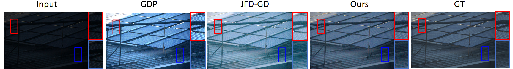

# Zero-DHF

<div align="center">

**[Paper Title]** Zero-DHF: A Zero-Shot Low-Light Enhancement Diffusion Model Fusing HVI Color Space and Fourier Prior

**[Authors]** Yongzhe Wang, Meng Jiang*, Junfeng Jing, Xinyao Li

[](https://www.sciencedirect.com/journal/signal-processing)
[](https://www.sciencedirect.com/journal/signal-processing)
[](https://www.eurasip.org/index.php?option=com_content&view=article&id=130&Itemid=132)

</div>

---

## 📢 News
- **[2026-01]** This paper has been submitted to **_Signal Processing_** (Elsevier).
- The full code and pre-trained models will be released here **immediately upon acceptance**.

## 🖼️ Gallery

### ✨ Qualitative Comparison
> Our method (Zero-DHF) achieves superior brightness recovery and color fidelity compared to SOTA methods.



### 🏗️ Framework
> The overall architecture of Zero-DHF, introducing the HVI color space into the diffusion process.


---

## 🚀 Abstract
Low-light image enhancement (LLIE) aims to mitigate image quality degradation stemming from insufficient illumination. However, existing zero-shot approaches often fail to concurrently balance color fidelity, structural details, and computational efficiency. 

To address this, we propose **Zero-DHF**, which:
1. **Decouples** intensity from chrominance using the **HVI Color Space**, avoiding color shifts.
2. Utilizes a **Fourier-prior-guided** diffusion model to restore the intensity component.
3. Achieves **SOTA** performance on the LOLv2_real dataset.

## 🛠️ Data Availability & Code
We are currently organizing the code and writing documentation to ensure reproducibility. 
- The inference scripts and model weights will be fully open-sourced.
- Detailed instructions for reproducing the paper's figures will be provided.

## ⚡ Prerequisites
- Linux or Windows
- Python 3.8+
- NVIDIA GPU + CUDA

## 📦 Installation
### Environment
```bash
conda env create --file environment.yml
conda activate Zero
