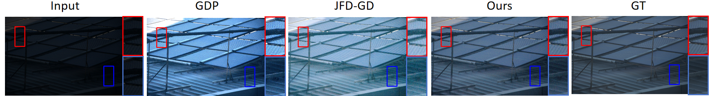

# Zero-DHF

<div align="center">

## Zero-DHF: Zero-Shot Low-Light Image Enhancement via HVI Color Disentanglement and Fourier-Guided Diffusion

**Yongzhe Wang, Meng Jiang\*, Junfeng Jing, Xinyao Li**  
\* Corresponding author

[]()
[]()
[]()

</div>

---

## 📢 News
- **[2026-01]** The manuscript of **Zero-DHF** is currently under review.
- Code, model weights, and reproduction instructions will be released after the review process.

---

## 🖼️ Overview

### Qualitative Comparison
Visual comparison of Zero-DHF with representative baselines on challenging low-light scenes.



### Framework
Overall architecture of Zero-DHF, which combines HVI-based color disentanglement with Fourier-guided diffusion restoration.


---

## 🚀 Abstract
Low-light image enhancement (LLIE) aims to recover visibility and perceptual quality from images captured under insufficient illumination. However, existing zero-shot or training-free approaches often struggle to simultaneously preserve color fidelity, structural consistency, and computational efficiency.  

To address this issue, we propose **Zero-DHF**, a zero-shot low-light image enhancement framework that combines **HVI-based luminance--chrominance disentanglement** with **Fourier-guided diffusion restoration**. Specifically, the proposed method first decouples illumination and chromaticity in the HVI space, so that the diffusion process focuses on the intensity component while preserving the original color structure. A lightweight Fourier-domain guidance mechanism is then introduced to constrain structural drift during reverse sampling. In addition, CLIP-based semantic guidance and structure-preserving constraints are incorporated during test-time optimization to further improve perceptual naturalness and local detail consistency.  

Experimental results on **LOLv1** and **LOLv2_Real** show that Zero-DHF achieves strong performance among training-free methods, especially on the more challenging LOLv2_Real benchmark.

---

## 🛠️ Repository Status
This repository is currently being organized for public release.  
After the review process, it will include:

- inference scripts
- environment configuration
- model preparation instructions
- pre-trained checkpoint links
- detailed reproduction guidance for the main experiments

---

## ⚙️ Requirements
- Linux
- Python 3.8+
- NVIDIA GPU with CUDA support

---

## 📦 Environment Setup
```bash
conda env create --file environment.yml
conda activate zerodhf
