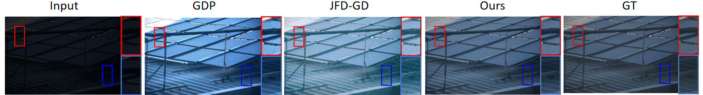

# Zero-DHF

<div align="center">

## Zero-DHF: Zero-Shot Low-Light Image Enhancement via HVI Color Disentanglement and Fourier-Guided Diffusion

**Yongzhe Wang, Junfeng Jing, Meng Jiang\*,  Xinyao Li， Yimin Zhi， Huanhuan Zhang**  
\* Corresponding author

[]()
[]()
[]()

</div>

---

## 📢 News
- **[2026-04]** The repository is being prepared for public release.
- Code, model weights, and detailed reproduction instructions will be made publicly available upon acceptance of the manuscript.

---

## 🖼️ Overview

### Qualitative Comparison
Visual comparison of Zero-DHF with representative baselines on challenging low-light scenes.



### Framework
Overall architecture of Zero-DHF, which combines HVI-based color disentanglement with Fourier-guided diffusion restoration.


---

## 🚀 Abstract
Low-light image enhancement (LLIE) is important for improving image visibility under challenging illumination conditions. Since collecting paired ground-truth data in real low-light scenes is difficult, training-free or zero-shot enhancement has emerged as a promising alternative. However, existing zero-shot diffusion-based methods often suffer from color shifts and structural distortions when restoration is performed in highly coupled RGB space. To address this issue, we propose Zero-DHF, a zero-shot diffusion framework that combines HVI-based luminance--chrominance disentanglement with Fourier-guided restoration. Specifically, an HVI-based disentanglement scheme separates the illumination component from fixed chrominance representations to alleviate generative color degradation. A Fourier-guided spectral fusion strategy is further introduced to preserve high-frequency details and reduce structural drift during reverse sampling. Moreover, instead of optimizing high-dimensional image pixels, we devise a test-time optimization (TTO) mechanism that updates only a single amplitude-scaling scalar under CLIP-based semantic and structure-preserving constraints. Extensive experiments demonstrate that Zero-DHF achieves strong performance among zero-shot methods, including 19.639 dB PSNR on LOLv2-Real, while effectively balancing illumination enhancement, color fidelity, and structural consistency.

---

## 🛠️ Repository Status
This repository is currently under organization for public release. The following materials will be provided after acceptance:

- inference scripts
- environment configuration
- model preparation instructions
- pre-trained checkpoint links
- detailed reproduction guidance for the main experiments

---

## ⚙️ Requirements
- Linux
- Python 3.8+
- NVIDIA GPU with CUDA support

---

## 📦 Environment Setup
```bash
conda env create --file environment.yml
conda activate zerodhf
